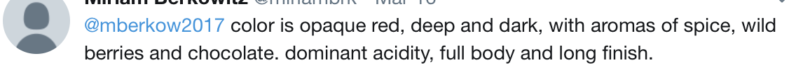
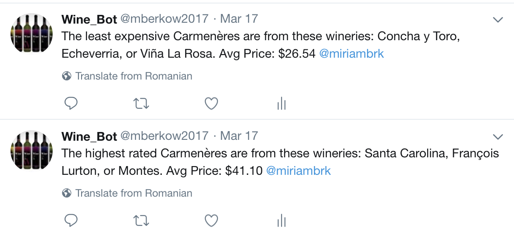
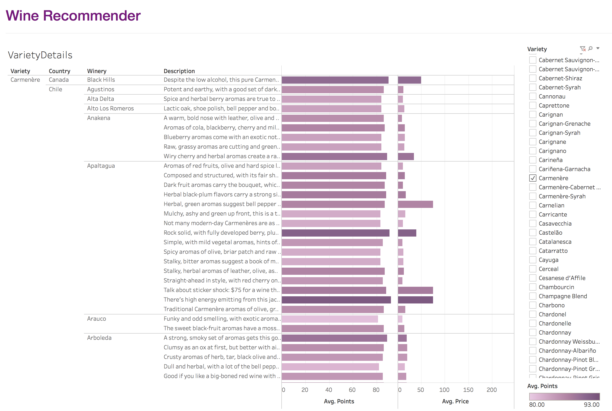

# Machine_Learning_Sommelier
This project creates a sommelier using machine learning to classify wines based on descriptions. It was a group project. 

Dataset used can be found here (originally from Wine Enthusiast magazine)
https://www.kaggle.com/zynicide/wine-reviews

File used is winemag-data_first150k.csv

Components: 
- A Twitter BOT that listens for a tweet requesting a wine recommendation, calls the machine learning model to get the recommendation, and then tweets out two responses:
  - Recommended variety of wine, along with the 3 top-rated wineries for that variety, and their average  price
  - Recommended variety of wine, along with the 3 least expensive wineries for that variety, and their average price
- Twitter BOT uses Tweepy; Twitter handle: @mberkow2017

- Machine learning model that reads a CSV file with Wine Enthusiast descriptions of wines, the wineries, points, and prices. The model uses natural language processing and a neural network to predict the wine variety based on an input description.
  - NLP uses count vectorizer and one-hot encoding
  - Neural Network has 1 hidden layer with 750 nodes and 364 ouputs; R-squared is 0.6
 
- Tabular data about the wines, varieties, and vineyards created using Tableau are incorporated into a website accessible from the Twitter BOT’s page

--------------------------------------------------------------------------------------------------------------------------------------

A Tweet to the BOT would look like this:

The response Tweets would look like this:

In conjunction with the Twitter BOT, which is @mberkow2017, is a website that describes the project and displays data from the CSV file using Tableau. The GitHub for that is: https://github.com/miriambrk/WineRecommender. The Tableau data requires an online Tableau login. The website is at http://miriamberkowitz.com/WineRecommender/

